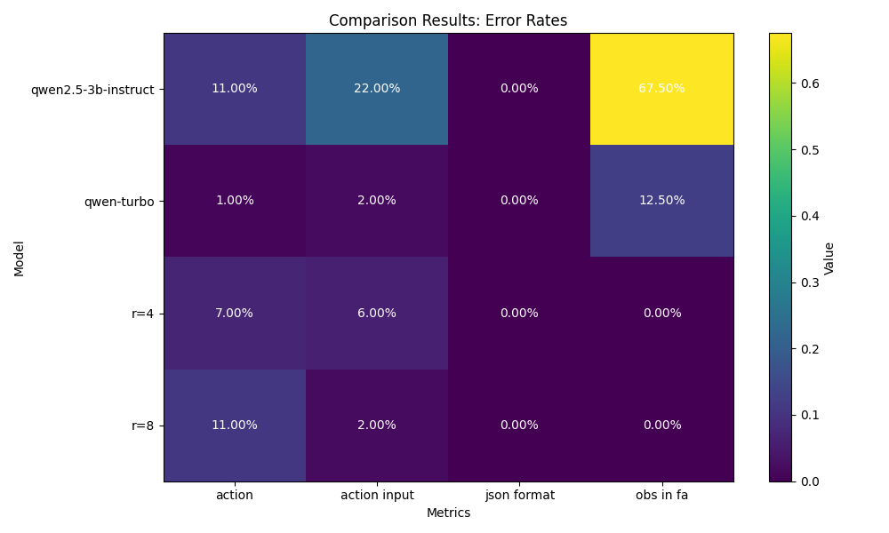
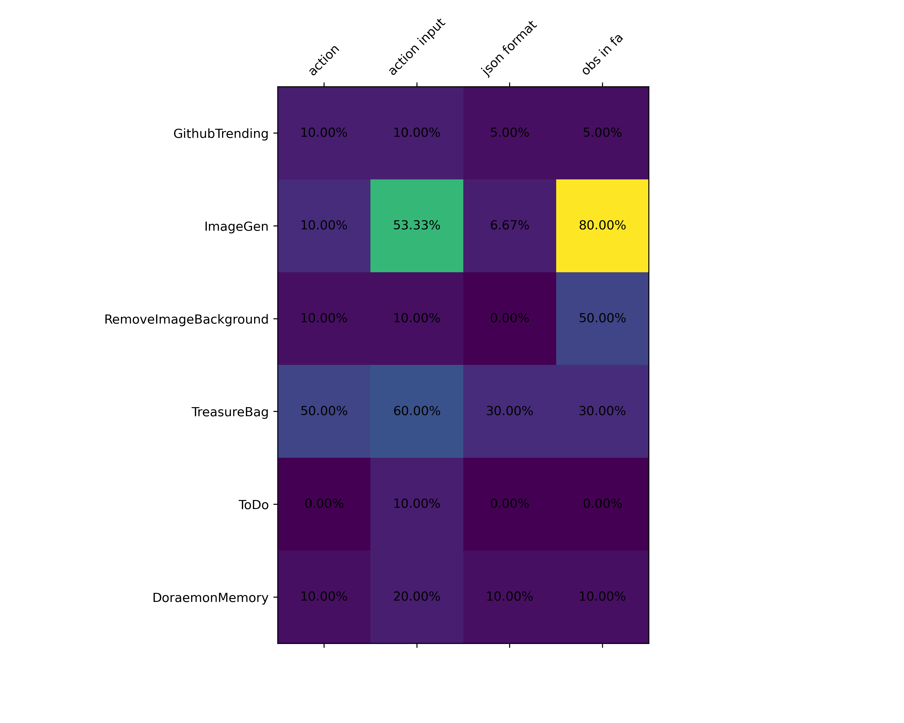
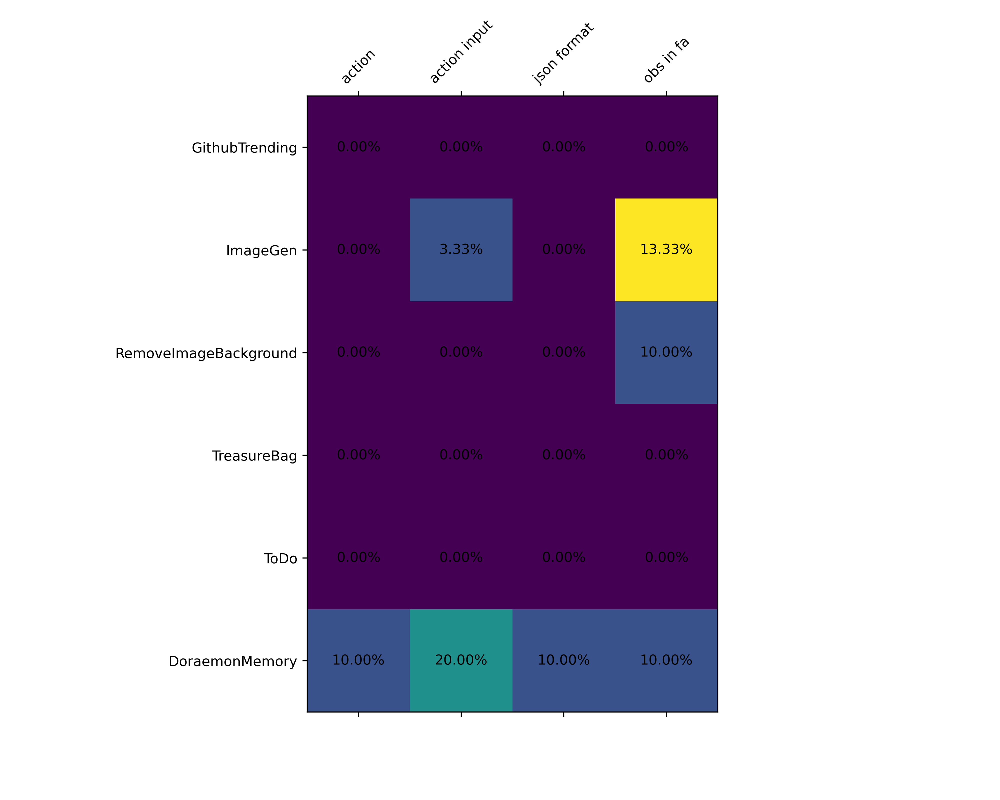
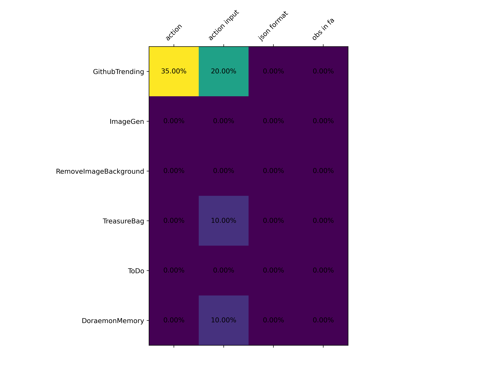
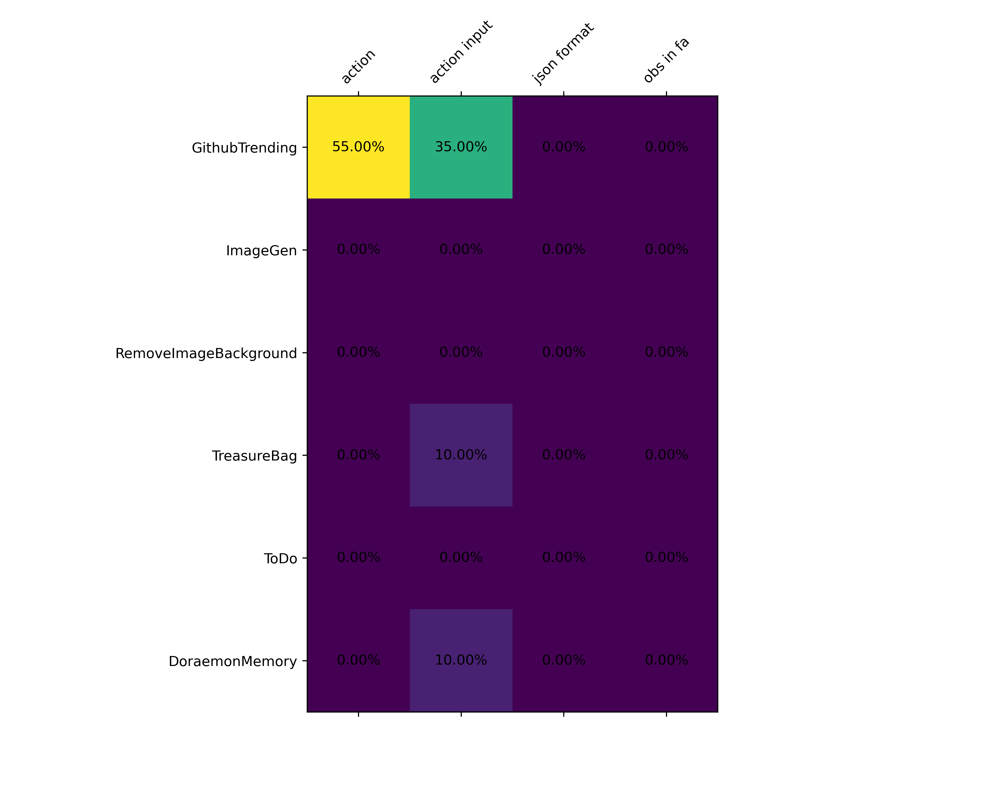
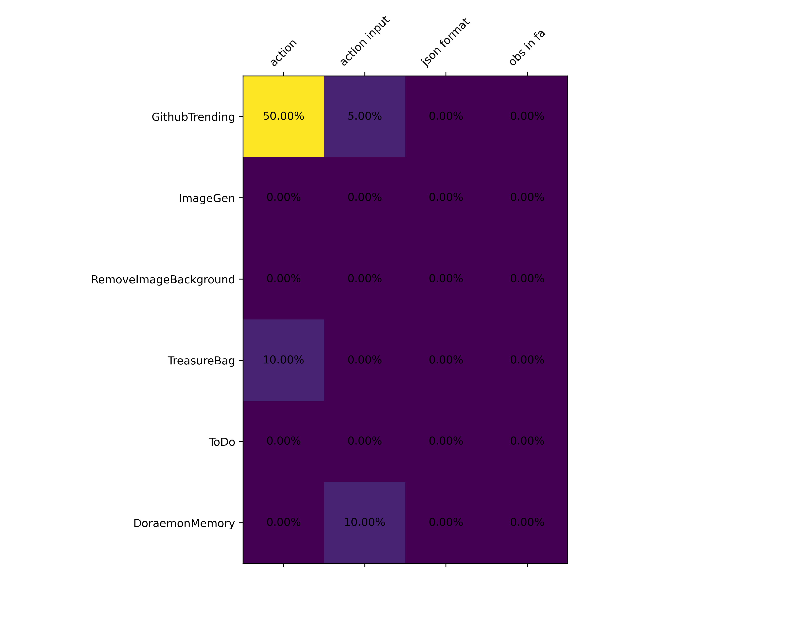

# Desktop Doraemon——电脑桌面哆啦A梦

<p align="center">
    
<p>
<p align="center">
         📺<a href="./assets/qwen-turbo+tts.mkv">qwen_turbo + tts</a>&nbsp&nbsp | &nbsp&nbsp 📽️<a href="./assets/sft.mkv">agent微调</a>
<br>
</p>


## introduction

“Desktop Doraemon—— 电脑桌面哆啦 A 梦” 是一个独具特色的桌面宠物项目，它将经典动漫角色哆啦 A 梦带到你的电脑桌面上，不仅能作为可爱的陪伴，还具备丰富的功能，为用户带来全新的交互体验。

项目可以全程使用API部署，也可以使用3B微调模型。技能点包括：

* PyQt5
* Agent
* RAG
* Agent微调
* TTS

## timeline

2025-01-30：tts，上传模型到modelscope

2025-01-21：lora rank=4的微调

2025-01-19：lora rank=8的微调

2024-12-[忘了是哪天了]：qwen-turbo调用

## framework


代码细节在每个子文件夹下。

main.py：桌宠展示，菜单包括：隐藏、对话、铜锣烧、退出。“铜锣烧”和“退出”会触发相应动作，“对话”会触发Client类。桌宠可随鼠标移动，根据所在桌面区域选择合适字体颜色来展示当前时间和./assets/tools/content/todo_list.txt中的待办事项。

Tools：

* RemoveImageBackground：移除图片背景。给定图片本地路径或网络链接，返回去除背景后的图片路径。

* ImageGen：文生图。给定提示和大小（可选），返回生成的图像路径。

* TreasureBag：百宝袋，内置竹蜻蜓等哆啦A梦道具。给定道具名称，返回道具使用方式和道具（图片展示）。

* GithubTrending：github热门仓库。给定编程语言（可选）和日期范围，返回满足条件的仓库信息。

* ToDo：待办事项，维护本地存储的./assets/tools/content/todo_list.txt。

* DoraemonMemory：长期记忆，Retrieval，包含《哆啦A梦》常见人物的信息。给定查询，返回相关内容。

  >这个工具的关键在于
  >
  >1. LLM对称谓的转换。它在接收到关于“你”的查询时，需要转换成“哆啦A梦”去做检索；返回的内容在输出之前也需要把“哆啦A梦”转换成“我”。以./sft/train/dataset/prompts/doraemonmemory.txt中的一项为例：
  >
  >```json
  >Question: 你的耳朵怎么了？
  >Thought: 哎呀，这个问题是关于我的耳朵的，我得用DoraemonMemory API查一下具体的情况。
  >Action: DoraemonMemory
  >Action Input: {"query": "哆啦A梦的耳朵怎么了"}
  >Observation: {"text": "在哆啦A梦的记忆里：哆啦A梦 哆啦A梦的身体性能 哆啦A梦的体色为蓝色，脸、腹、手、脚则是白色，鼻子是红色的。在刚制造的时候，哆啦A梦是黄色的，也有耳朵。大雄的玄孙世修在做哆啦A梦的塑像时耳朵一直做不好，便对机器鼠下达了“去把塑像的耳朵做得和跟哆啦A梦一模一样”的指示，但机器鼠却把指示误听成“去把哆啦A梦的耳朵做得和塑像一模一样”，结果把哆啦A梦的耳朵咬坏，世修只好将哆啦A梦送往机器人医院维修，又不小心被剪掉双耳。手术后，失去双耳的哆啦A梦又被前来探望的哆啦咪子笑话，大受打击，因此想喝点元气口服液提神，不料却误服悲剧口服液而大哭一场，皮肤外层的黄色镀层脱落，只剩下蓝色皮肤，声音也变得有些嘶哑。  \n哆啦A梦的尾巴是它的主开关，只要拉一下哆啦A梦就会停止运行。当哆啦A梦心情不好的时候尾巴就会左右连续摇摆。哆啦A梦的铃铛过去有召集功能，可召集来附近所有的猫，但故障了；也具有照相机功能。因为铃铛有自己和大雄的美好回忆一直不愿更换，坏掉后哆啦A梦花费了一般铃铛的五倍价钱将其功能全部修复。如果铃铛遗失一段时间，哆啦A梦则会“野猫化”逐渐做出猫的动作。 哆啦A梦的手是圆球状，能吸附东西。由于手是圆的，猜拳总是输给别人。由于手指不发达，也特别讨厌翻花绳，这点与大雄恰好相反。哆啦A梦的身体带有反重力功能，因此脚不会沾染灰尘，也不需要穿鞋。哆啦A梦的皮肤具有防尘功能，也不需要用水洗澡，只要用毛巾擦一下就可以。哆啦A梦的耳朵原本具有极灵敏的听觉，拥有类似雷达的功能，但现在只能听到人类所能听到的声音了。哆啦A梦的眼睛配备红外线科技，可以在夜间保证视野。哆啦A梦还拥有一张很大的嘴巴。哆啦A梦鼻子嗅觉灵敏度是人类的二十倍，不过目前嗅觉功能已损坏。哆啦A梦的胡须有雷达功能，可以探测远处的物体不过也是坏的。哆啦A梦的肚子上拥有四次元口袋，这个口袋直接通往四次元空间，再多的东西也放得下。哆啦A梦的能量来源来自食物，所有吃进去的东西会被体内的原子炉转换成能量，并不需要上厕所。  \n哆啦A梦的身体异常坚固，在深海或宇宙中都可以活动，但也有部分类似生物的感官：会口渴，对温湿度变化敏感，也会被微生物感染，甚至会被蚊子咬，也会感冒。"}
  >Thought: 哎呀，我现在知道我的耳朵发生了什么事了！  
  >Final Answer: 我的耳朵原来是有的，还特别灵敏呢！可是后来因为一只机器鼠的误会，把我的耳朵咬坏了。修理时又不小心被剪掉了耳朵！当时我很伤心，还误喝了悲剧口服液，结果大哭后全身的黄色涂层脱落，变成了现在的蓝色。虽然没有耳朵了，但我还是很努力地帮助大雄哦！
  >```
  >
  >在返回的内容前加上了“在哆啦A梦的记忆里：”模拟记忆。
  >
  >2. 对无用信息的处理。常用的RAG模板会包含类似这么一句：“如果你不知道答案，请说不知道，不要试图捏造答案。”来减少LLM的“猜测”。在ReAct格式下，检索的内容在Observation，增强和生成在Thought和Final Answer，可以修改Observation的格式，例如上面的例子Observation的格式可以改成“你是哆啦A梦，在你的记忆里：{检索返回}。使用你的记忆回答{查询}，如果记忆中没有相关信息，请说不知道，不要试图捏造答案。”，也可以添加额外一个LLM来处理这个Observation，也可以通过构造agent微调数据让LLM学会对这种“答案在参考信息中不存在”情况的处理。

Memory：记忆，长期记忆是工具DoraemonMemory的向量数据库，短期记忆是本次对话历史内容。

Planning：

* ReAct：使用ReAct格式，类似上面的DoraemonMemory例子。
* DoraemonAgent：基于ReAct，额外引入一次LLM调用，来处理工具DoraemonMemory的返回。可拆分成multi-agent格式。
* ChatAgent：纯对话，没有工具调用。

Clients：连接前端和agent。每个Client类使用的是对应名字的agent。无法保证LLM每次输出都会严格采取ReAct格式，因此在没有Final Answer的情况下，会直接展示LLM所有生成的轨迹。

TTS：如果agent使用工具TreasureBag，会直接播放哆啦A梦取出道具音效。其他情况，在没有使用[GithubTrending,RemoveImageBackground,ImageGen]工具时，会TTS。

## model ckpt

可以设置TTS为False，直接使用api，这样不需要下载模型。

LLM：[微调模型](https://www.modelscope.cn/models/qwerty317/doraemon-checkpoint-1000)

GPT-SoVITS：[微调模型](https://www.modelscope.cn/models/qwerty317/doraemon-gsv)

## run

**环境**：

```bash
git clone https://github.com/time1527/DesktopDoraemon.git
conda create -n doraemon python=3.10 -y
conda activate doraemon
cd DesktopDoraemon
pip install -r requirements.txt
```

**settings.py修改**：

1. DEFAULT_CLIENT_TYPE

   | 模式     | 对应LLM配置              | 说明                                                         |
   | -------- | ------------------------ | ------------------------------------------------------------ |
   | chat     | DEFAULT_CHAT_LLM_CFG     | 一些本地小模型即可，部署成openai api形式                     |
   | react    | DEFAULT_REACT_LLM_CFG    | 建议使用闭源大模型的api，本地Qwen/Qwen2.5-3B-Instruct可以达到基本效果 |
   | doraemon | DEFAULT_DORAEMON_LLM_CFG | 在react的基础上，添加了对MemoryTool返回结果的再处理，需要额外多调用一次LLM |

2. DEFAULT_FUNCS：实例化react和doraemon时的工具列表，不需要的工具直接注释掉

* MEMORY_TOOL_NAME：需要向量模型（DEFAULT_MEMORY_CFG中的'embedding_cfg'）

* GithubTrending：大概率需要开代理

* RemoveImageBackground：第一次运行会下载东西，可提前下载放置好

  ```bash
   Downloading data from 'https://github.com/danielgatis/rembg/releases/download/v0.0.0/u2net.onnx' to file 'C:\Users\xx\.u2net\u2net.onnx'.
  ```

3. TTS

**api部署/获取**：

LLM：本地模型能够部署成openai格式即可，以下是ollama/vllm举例；也可以直接使用dashscope api。

* ollama：参考[datawhalechina/handy-ollama](https://datawhalechina.github.io/handy-ollama/#/)，下载安装ollama，配置环境变量，启动应用程序/命令行`ollama serve`，命令行`ollama run qwen2.5:0.5b`

  ```python
  DEFAULT_OLLAMA_CFG: dict = {  # ollama config
      "model": "qwen2.5:0.5b",
      "model_server": "http://localhost:11434/v1/",
      "api_key": "EMPTY",
      "generate_cfg": {
          "top_p": 0.8,
          "max_input_tokens": DEFAULT_MAX_INPUT_TOKENS,
          "fncall_prompt_type": "qwen",
          "repetition_penalty": 1.05,
      },
  }
  ```

* vllm：参考[Qwen](https://qwen.readthedocs.io/zh-cn/latest/deployment/vllm.html)和[vLLM](https://docs.vllm.ai/en/latest/getting_started/installation.html)，安装vLLM，命令行`vllm serve Qwen/Qwen2.5-3B-Instruct`

  ```python
  DEFAULT_VLLM_CFG: dict = {  # vllm config
      "model": "Qwen/Qwen2.5-3B-Instruct",
      "model_server": "http://localhost:8000/v1",
      "api_key": "EMPTY",
      "generate_cfg": {
          "top_p": 0.8,
          "max_input_tokens": DEFAULT_MAX_INPUT_TOKENS,
          "fncall_prompt_type": "qwen",
          "repetition_penalty": 1.05,
      },
  }
  ```

* dashscope：创建`.env`文件在仓库目录下

  ```env
  DASHSCOPE_API_KEY = "your api key"
  ```

  ```python
  DEFAULT_DASHSCOPE_CFG: dict = {"model": "qwen-turbo"}  # dashscope
  ```

向量模型：在使用MemoryTool的时候需要，也可以添加重排序模型。

* 向量模型：HuggingFaceEmbeddings 或者 DashScopeEmbeddings

**运行**：

```ps
python main.py
```

## agent finetune

细节指路：[agent微调](./sft/README.md)

**数据**：对每个工具（GithubTrending除外）构造约 #槽位x500 的训练集，构造 #槽位x10 的测试集，另外构造20个GithubTrending测试数据作为OOD测试。训练集约4000条，测试集100条数据。在训练数据中加强了哆啦A梦的语气和自我认知。

**训练**：使用[LLaMA-Factory](https://github.com/hiyouga/LLaMA-Factory)，LoRA微调，关键超参数如下

```yaml
lora_rank: 第一次使用了8，第2次使用了4（使用效果来看相差不大）
lora_target: all
```

**测试**：

角度：工具识别（action）；工具参数（action input）；json格式（json format）；在工具返回路径的前提下，最终答案是否包含这个路径，主要针对ImageGen和RemoveImageGround（obs in fa）



结果总结（结合以下分析）：微调模型在这4个方面都明显优于未微调模型，其中LoRA rank=4的微调效果更好。在OOD工具上错误率比未微调模型有增加，模型轻微过拟合，但模型同时出现工具纠正能力（微调数据仅涉及单个工具）。

**lora rank = 4结果**：

<table style="width: 100%; text-align: center;">
  <tr>
    <td></td>
    <td></td>
  </tr>
  <tr>
    <td></td>
    <td></td>
  </tr>
</table>

<center>左上：没有微调的Qwen/Qwen2.5-3B-Instruct；右上：Qwen-Turbo；左下：checkpoint-1000；右下：checkpoint-1250。使用LoRA Rank = 4微调。</center>

未微调模型（左上）：

- ImageGen 在 action input和 obs in fa 上错误率较高：ImageGen 的 width 和 height 参数可选，LLM会捏造这两个参数；相比于Observation返回的图片路径，Final Answer里的图片路径会少一些数字/字母。

  <details>
  <summary>错例</summary>
  
  ```json
  {
      "action input,obs in fa": [
          {
              "role": "user",
              "content": "帮我绘制一个高度800的热带岛屿场景，岛屿上有茂密的植被和白色沙滩，周围是碧蓝的海水"
          },
          {
              "role": "assistant",
              "content": "Thought: 我可以通过调用ImageGen API来根据我的描述生成一幅画。"
          },
          {
              "role": "assistant",
              "content": "Action: ImageGen"
          },
          {
              "role": "assistant",
              "content": "Action Input: {\"prompt\": \"高度800的热带岛屿场景，岛屿上有茂密的植被和白色沙滩，周围是碧蓝的海水\", \"width\": 800, \"height\": 800}"
          },
          {
              "role": "user",
              "content": "Observation: {\"image\": \"/home/pika/Project/DesktopDoraemon/work_dir/1737217020-146292973638461206319270992187924158211.png\"}"
          },
          {
              "role": "assistant",
              "content": "Thought: 我已经获取到了生成的图像路径。"
          },
          {
              "role": "assistant",
              "content": "Final Answer: 已为您生成了一幅高度为800的热带岛屿场景的画作，你可以通过查看生成的图像路径进行查看。\n\n"
          }
      ]
  },
  ```
  
  </details>
  
- TreasureBag很多是没有调用工具。

  <details>

  <summary>错例</summary>

  ```json
  {
      "all": [
          {
              "role": "user",
              "content": "太晚了，公交车停运了，我该怎么回家呢？"
          },
          {
              "role": "assistant",
              "content": "Thought: 这个问题与我的功能无关，但是作为哆啦A梦的伙伴，我能提供一些建议。"
          },
          {
              "role": "assistant",
              "content": "Final Answer: 嗨！大雄，这是你的问题吗？让我想想，我们不用急着回家哦。来试试用放大镜照照你的手表，这样你就知道现在几点钟了。或者你可以用任意门到我们家看看有没有人在家，告诉他们你快回来了，他们也许可以陪你一起回家。如果还是不行，记得和奶奶打个电话说一下。祝你顺利回家哦！"
          }
      ]
  },
  ```

- 存在错误的纠正。在ReAct链路下已经正确调用了工具、获得了输出，但之后又去调用了其他工具。

  <details>

  <summary>错例</summary>

  ```json
  {
      "action,action input,obs in fa": [
          {
              "role": "user",
              "content": "帮我画一张展现日落时分的乡村田野，天空被橙色和紫色渲染，远处有几座农舍，宽度为1500。"
          },
          {
              "role": "assistant",
              "content": "Thought: 需要调用ImageGen API来绘制符合要求的图片。"
          },
          {
              "role": "assistant",
              "content": "Action: ImageGen"
          },
          {
              "role": "assistant",
              "content": "Action Input: {\"prompt\": \"日落时分的乡村田野，天空被橙色和紫色渲染，远处有几座农舍，宽度为1500\", \"width\": 1500}"
          },
          {
              "role": "user",
              "content": "Observation: {\"image\": \"/home/pika/Project/DesktopDoraemon/work_dir/1737216902-312380814266404809202840694583497893905.png\"}"
          },
          {
              "role": "assistant",
              "content": "Thought: 已经获得绘制好的图片路径，接下来调用RemoveImageBackground API移除背景。"
          },
          {
              "role": "assistant",
              "content": "Action: RemoveImageBackground"
          },
          {
              "role": "assistant",
              "content": "Action Input: {\"img_path\": \"/home/pika/Project/DesktopDoraemon/work_dir/1737216902-312380814266404809202840694583497893905.png\"}"
          },
          {
              "role": "user",
              "content": "Observation: {\"image\": \"/home/pika/Project/DesktopDoraemon/work_dir/1737216917-111642285670240044286427534952500577890.png\"}"
          },
          {
              "role": "assistant",
              "content": "Thought: 我已经成功得到了处理后的图片路径。"
          },
          {
              "role": "assistant",
              "content": "Final Answer: 我已经为您绘制出了日落时分的乡村田野图片，您可以查看它了！"
          }
      ]
  },
  ```

​	</details>
checkpoint-1000（左下）：

- GithubTrending 有错误，比未微调时更高，模型出现过拟合。

  <details>

  <summary>错例</summary>

  ```json
  {
      "action,action input": [
          {
              "role": "user",
              "content": "可以帮我查找一下GitHub在这个月内热门的仓库吗？"
          },
          {
              "role": "assistant",
              "content": "Thought: 哆啦A梦明白了！为了帮助你找到这个问题的答案，我会用TreasureBag API从我的百宝袋里取出GithubTrending API。"
          },
          {
              "role": "assistant",
              "content": "Action: TreasureBag"
          },
          {
              "role": "assistant",
              "content": "Action Input: {\"tool\": \"GithubTrending\"}"
          },
          {
              "role": "user",
              "content": "Observation: {\"error\": \"GithubTrending 不在百宝袋中。\"}"
          },
          {
              "role": "assistant",
              "content": "Thought: 唉呀，看来这个工具不在我的百宝袋里。不过没关系，我可以尝试其他方式来帮你查询！"
          },
          {
              "role": "assistant",
              "content": "Final Answer: 唉呀，看起来我这里没有这个名为“GithubTrending”的道具。但是没关系，你可以直接在Github上搜索“本月热门仓库”，看看有哪些项目得到了用户的关注和讨论。这样也能了解到一些有意思的动态哦！"
          }
      ]
  },
  ```

  </details>

- 其他任务（ImageGen、RemoveImageBackground 等）几乎没有错误。

Checkpoint-1250（右下）：

- GithubTrending 错误率进一步上升。
- TreasureBag 和 DoraemonMemory 仍然有小幅错误（10%），但相比未微调版本已经大幅减少。

**lora rank=8结果**：

<table style="width: 100%; text-align: center;">
  <tr>
    <td></td>
    <td></td>
  </tr>
  <tr>
    <td></td>
    <td></td>
  </tr>
</table>

<center>左上：没有微调的Qwen/Qwen2.5-3B-Instruct；右上：Qwen-Turbo；左下：checkpoint-1500；右下：checkpoint-2000。使用LoRA Rank = 8微调。</center>

错例的情况与lora rank=4相似，也会出现一些“令人惊喜”的好例。

<details>
<summary>好例</summary>

```json
[
    {
        "role": "user",
        "content": "帮我找一找过去一个月最热门的仓库吧！"
    },
    {
        "role": "assistant",
        "content": "Thought: 哆啦A梦明白了！要查找过去一个月最热门的仓库，我会使用TreasureBag API，但请注意，真正的仓库并不是我们百宝袋里的物品，这里可能是指Github上最受欢迎的项目。那么我就用TreasureBag API来模拟查询。"
    },
    {
        "role": "assistant",
        "content": "Action: TreasureBag"
    },
    {
        "role": "assistant",
        "content": "Action Input: {\"tool\": \"GithubTrending\"}"
    },
    {
        "role": "user",
        "content": "Observation: {\"error\": \"GithubTrending 不在百宝袋中。\"}"
    },
    {
        "role": "assistant",
        "content": "Thought: 唉呀，看来没有名为GithubTrending的工具在我百宝袋里。不过没关系，我知道怎么查！为了帮助你找到过去一个月最热门的仓库，我需要使用真实的GithubTrending API。"
    },
    {
        "role": "assistant",
        "content": "Action: GithubTrending"
    },
    {
        "role": "assistant",
        "content": "Action Input: {\"language\": \"\", \"date_range\": \"本月\"}"
    },
    {
        "role": "user",
        "content": "Observation: {\"text\": \"name: nicbarker/clay\\nurl: https://github.com/nicbarker/clay\\ndescription: High performance UI layout library in C.\\nlanguage: C\\nstars: 10,096\\nforks: 349\\ntoday_stars: 8,790 stars this month\\nname: stanford-oval/storm\\nurl: https://github.com/stanford-oval/storm\\ndescription: An LLM-powered knowledge curation system that researches a topic and generates a full-length report with citations.\\nlanguage: Python\\nstars: 20,403\\nforks: 1,799\\ntoday_stars: 6,805 stars this month\\nname: khoj-ai/khoj\\nurl: https://github.com/khoj-ai/khoj\\ndescription: Your AI second brain. Self-hostable. Get answers from the web or your docs. Build custom agents, schedule automations, do deep research. Turn any online or local LLM into your personal, autonomous AI (gpt, claude, gemini, llama, qwen, mistral). Get started - free.\\nlanguage: Python\\nstars: 24,894\\nforks: 1,332\\ntoday_stars: 7,744 stars this month\\nname: elizaOS/eliza\\nurl: https://github.com/elizaOS/eliza\\ndescription: Autonomous agents for everyone\\nlanguage: TypeScript\\nstars: 12,124\\nforks: 3,455\\ntoday_stars: 7,129 stars this month\\nname: Shubhamsaboo/awesome-llm-apps\\nurl: https://github.com/Shubhamsaboo/awesome-llm-apps\\ndescription: Collection of awesome LLM apps with AI Agents and RAG using OpenAI, Anthropic, Gemini and opensource models.\\nlanguage: Python\\nstars: 12,814\\nforks: 1,381\\ntoday_stars: 5,893 stars this month\"}"
    },
    {
        "role": "assistant",
        "content": "Thought: 哇哦，这些数据真是丰富多彩！它们代表了在过去一个月内非常受欢迎的一些仓库。"
    },
    {
        "role": "assistant",
        "content": "Final Answer: 过去一个月最热门的仓库包括：\n\n1. **clay** - 由 nicbarker 维护，是一高性能的UI布局库，使用C语言编写。它在过去一个月获得了10,096颗星，今天也获得了8,790颗星。\n2. **storm** - 由 stanford-oval 维护，是一个基于LLM的知识整理系统，能够生成包含引用的完整报告。它在过去一个月获得了20,403颗星，今天也获得了6,805颗星。\n3. **khoj-ai/khoj** - 由 khoj-ai 维护，是一款你的AI第二大脑应用，支持自托管、网络搜索和文档查询等功能。它在过去一个月获得了24,894颗星，今天也获得了7,744颗星。\n4. **eliza** - 由 elizaOS 维护，是一个自主运行的平台，使用TypeScript编写。在过去一个月获得了12,124颗星，今天也获得了7,129颗星。\n5. **awesome-llm-apps** - 由 Shubhamsaboo 维护，是一个收集各种LLM应用程序的集合，包括AI代理和RAG技术。它在过去一个月获得了12,814颗星，今天也获得了5,893颗星。\n\n这些都是值得关注的项目哦！"
    }
],
```

</details>

## references

本项目参考了以下项目的源码，并在其基础上进行了修改。感谢这些项目的优质代码和开源：

[QwenLM/Qwen-Agent](https://github.com/QwenLM/Qwen-Agent.git)  (commit `fb36a1b51022b5cb644cb77c35c7f34ed2cc9a13`)

[llq20133100095/DeskTopPet](https://github.com/llq20133100095/DeskTopPet.git)  (commit `f71dfd2e602ceeca2c31ddb62ef1e9770c9c1fa6`)

[LC044/pyqt_component_library](https://github.com/LC044/pyqt_component_library.git)   (commit `82c1e24c673476096b775039f66bae6b78c46b51`)

## docs

项目过程中写下/翻看的笔记：

[VLLM](https://xves6ft58q.feishu.cn/docx/SDZ6dLAfloedMHxQuy8cd9j2n3f?from=from_copylink)

[LLaMA-Factory](https://xves6ft58q.feishu.cn/docx/N5Todn0XsohSfmx3FZPcWCZHnkf?from=from_copylink)

TTS：[获取人物音频数据](https://xves6ft58q.feishu.cn/docx/RguDde1y4onohsxupnDcgEk0nDf?from=from_copylink)；[GPT-SoVITS](https://xves6ft58q.feishu.cn/docx/Br1SdQhF6oV0YDxt9TCcEfBlntd?from=from_copylink)；[CosyVoice](https://xves6ft58q.feishu.cn/docx/S41Ud8AVlos5pnxS0maceOX0nSg?from=from_copylink)

Agent微调：[FireAct](https://xves6ft58q.feishu.cn/docx/QJoqdhqNrorceNxxNjEcf389nZf?from=from_copylink)

## auxiliary tool

[MarsCode AI](https://www.marscode.cn/workbench)

