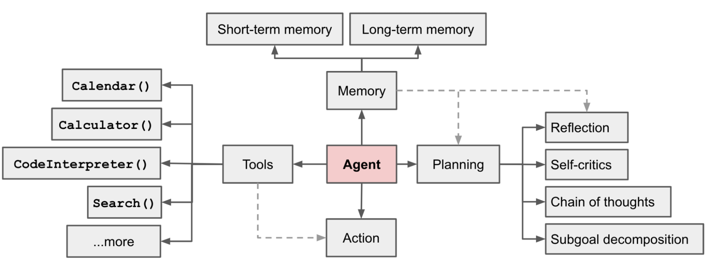

> Reference Repositories: 
>
> [QwenLM/Qwen-Agent](https://github.com/QwenLM/Qwen-Agent.git)  (commit `fb36a1b51022b5cb644cb77c35c7f34ed2cc9a13`)
>
> [llq20133100095/DeskTopPet](https://github.com/llq20133100095/DeskTopPet.git) (commit `f71dfd2e602ceeca2c31ddb62ef1e9770c9c1fa6`)
>
> [LC044/pyqt_component_library](https://github.com/LC044/pyqt_component_library.git) (commit `82c1e24c673476096b775039f66bae6b78c46b51`)

使用Qwen-Agent（源码拆解）和PyQt5实现的桌面哆啦A梦

[视频](./data/video.webm)

## structure


### notice



<center>图片来自：https://lilianweng.github.io/posts/2023-06-23-agent/ Fig. 1. Overview of a LLM-powered autonomous agent system.<center>

在代码实现中，长期记忆与工具中的`MEMORY_TOOL_NAME`绑定：只有当`MEMORY_TOOL_NAME`或其关联的工具出现在agent类初始化的`function_list`中时，才有可能触发长期记忆（RAG形式的实现）

### more detail

[agents](./agents/README.md)

[llms](./llms/README.md)

[tools](./tools/README.md)

[clients](./clients/README.md)

## run

1. 环境：

   ```bash
   conda create -n doraemon python=3.10 -y
   conda activate doraemon
   pip install -r requirements.txt
   ```

2. settings.py修改：DEFAULT_CLIENT_TYPE

   * "chat"：DEFAULT_CHAT_LLM_CFG，一些本地小模型即可，部署成openai api形式

   * "react"：DEFAULT_REACT_LLM_CFG，建议使用闭源大模型的api

     * DEFAULT_FUNCS：其中不需要的工具直接注释掉

       * MEMORY_TOOL_NAME：需要向量模型（DEFAULT_MEMORY_CFG中的'embedding_cfg'）

       * "GithubTrending"：大概率需要开代理

       * "RemoveImageBackground"：第一次运行会下载东西，可提前下载放置好

         ```bash
          Downloading data from 'https://github.com/danielgatis/rembg/releases/download/v0.0.0/u2net.onnx' to file 'C:\Users\xx\.u2net\u2net.onnx'.
         ```

3. 额外：

   * 按需安装/获取大模型api key

     ollama：

     ```python
     DEFAULT_OAI_CFG: dict = {
         'model':'qwen2.5:0.5b',
         'model_server':"http://localhost:11434/v1/",
         'api_key': 'EMPTY',
         'generate_cfg': {
             'top_p': 0.8,
             'max_input_tokens': 6500,
             'fncall_prompt_type': 'qwen',
         }
     }
     ```

     参考[datawhalechina/handy-ollama](https://datawhalechina.github.io/handy-ollama/#/)：下载安装ollama，配置环境变量，启动应用程序/命令行`ollama serve`，命令行`ollama run qwen2.5:0.5b`

     dashscope：创建`.env`文件在本仓库目录下

     ```.env
     DASHSCOPE_API_KEY = "your api key"
     ```

   * 向量模型：HuggingFaceEmbeddings 或者 DashScopeEmbeddings

4. ```
   python main.py
   ```

## to be solved

1. 调用GithubTrending，最终答案在"\n\n"后不再显示

## references

[QwenLM/Qwen-Agent](https://github.com/QwenLM/Qwen-Agent.git)

[llq20133100095/DeskTopPet](https://github.com/llq20133100095/DeskTopPet.git)

[LC044/pyqt_component_library](https://github.com/LC044/pyqt_component_library.git) 

[datawhalechina/handy-ollama](https://datawhalechina.github.io/handy-ollama/#/)

## auxiliary tool

[MarsCode AI](https://www.marscode.cn/workbench)

