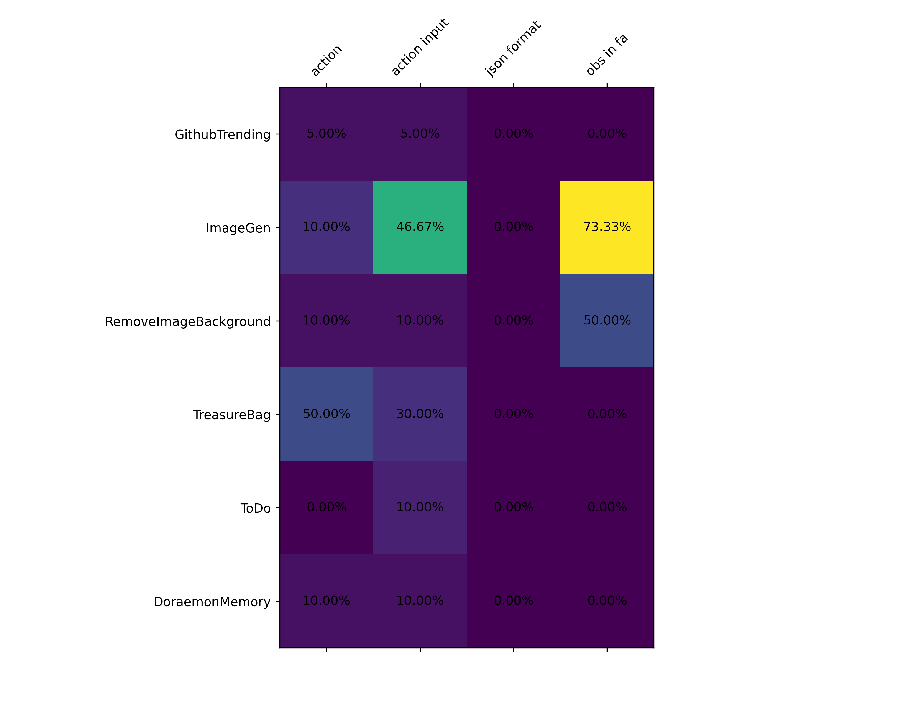
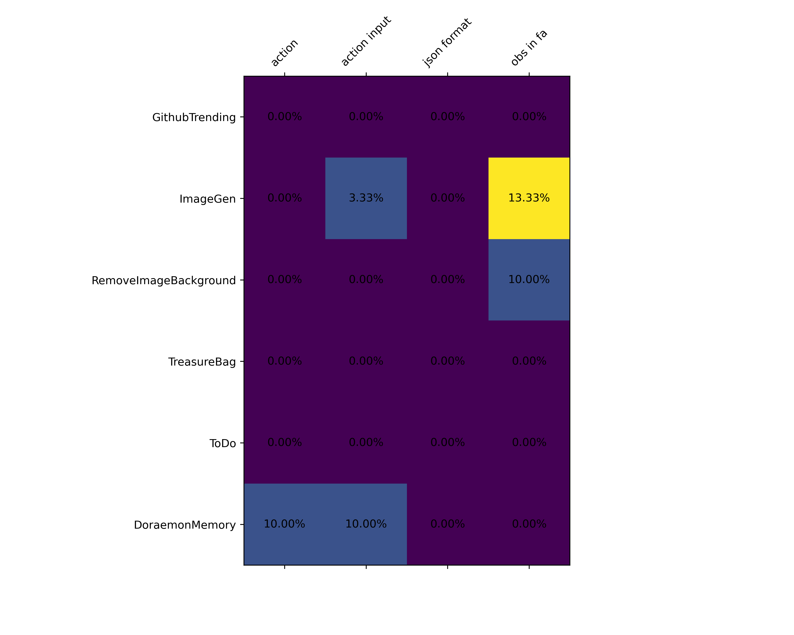

# Desktop Doraemon——电脑桌é¢å“†å•¦A梦

<p align="center">
    
<p>
<p align="center">
         📺<a href="./assets/qwen-turbo+tts.mkv">qwen_turbo + tts</a>&nbsp&nbsp | &nbsp&nbsp 📽ï¸<a href="./assets/sft.mkv">agent微调</a>
<br>
</p>


## introduction

“Desktop Doraemon—— 电脑桌é¢å“†å•¦ A 梦†是一个独具特色的桌é¢å® ç‰©é¡¹ç›®ï¼Œå®ƒå°†ç»å…¸åŠ¨æ¼«è§’色哆啦 A 梦带到你的电脑桌é¢ä¸Šï¼Œä¸ä»…能作为å¯çˆ±çš„陪伴，还具备丰富的功能，为用户带æ¥å…¨æ–°çš„交互体验。

项目å¯ä»¥å…¨ç¨‹ä½¿ç”¨API部署，也å¯ä»¥ä½¿ç”¨3B微调模å‹ã€‚技能点包括：

* PyQt5
* Agent
* RAG
* Agent微调
* TTS

## timeline

2025-01-30：tts，上传模å‹åˆ°modelscope

2025-01-21：lora rank=4的微调

2025-01-19：lora rank=8的微调

2024-12-[忘了是哪天了]：qwen-turbo调用

## framework


代ç ç»†èŠ‚在æ¯ä¸ªå­æ–‡ä»¶å¤¹ä¸‹ã€‚

main.py：桌宠展示，èœå•åŒ…括：éšè—ã€å¯¹è¯ã€é“œé”£çƒ§ã€é€€å‡ºã€‚“铜锣烧â€å’Œâ€œé€€å‡ºâ€ä¼šè§¦å‘相应动作，“对è¯â€ä¼šè§¦å‘Client类。桌宠å¯éšé¼ æ ‡ç§»åŠ¨ï¼Œæ ¹æ®æ‰€åœ¨æ¡Œé¢åŒºåŸŸé€‰æ‹©åˆé€‚字体颜色æ¥å±•ç¤ºå½“å‰æ—¶é—´å’Œ./assets/tools/content/todo_list.txt中的待åŠäº‹é¡¹ã€‚

Tools：

* RemoveImageBackground：移除图片背景。给定图片本地路径或网络链æ¥ï¼Œè¿”å›å»é™¤èƒŒæ™¯å的图片路径。

* ImageGen：文生图。给定æ示和大å°ï¼ˆå¯é€‰ï¼‰ï¼Œè¿”å›ç”Ÿæˆçš„图åƒè·¯å¾„。

* TreasureBag：百å®è¢‹ï¼Œå†…置竹蜻蜓等哆啦A梦é“具。给定é“å…·å称，返å›é“具使用方å¼å’Œé“具（图片展示）。

* GithubTrending：github热门仓库。给定编程语言（å¯é€‰ï¼‰å’Œæ—¥æœŸèŒƒå›´ï¼Œè¿”å›æ»¡è¶³æ¡ä»¶çš„仓库信æ¯ã€‚

* ToDo：待åŠäº‹é¡¹ï¼Œç»´æŠ¤æœ¬åœ°å­˜å‚¨çš„./assets/tools/content/todo_list.txt。

* DoraemonMemory：长期记忆，Retrieval，包å«ã€Šå“†å•¦A梦》常è§äººç‰©çš„ä¿¡æ¯ã€‚给定查询，返å›ç›¸å…³å†…容。

  >这个工具的关键在äº
  >
  >1. LLM对称谓的转æ¢ã€‚它在æ¥æ”¶åˆ°å…³äºâ€œä½ â€çš„查询时，需è¦è½¬æ¢æˆâ€œå“†å•¦A梦â€å»åšæ£€ç´¢ï¼›è¿”å›çš„内容在输出之å‰ä¹Ÿéœ€è¦æŠŠâ€œå“†å•¦A梦â€è½¬æ¢æˆâ€œæˆ‘â€ã€‚以./sft/train/dataset/prompts/doraemonmemory.txt中的一项为例：
  >
  >```json
  >Question: 你的耳朵æ€ä¹ˆäº†ï¼Ÿ
  >Thought: å“呀，这个问题是关äºæˆ‘的耳朵的，我得用DoraemonMemory API查一下具体的情况。
  >Action: DoraemonMemory
  >Action Input: {"query": "哆啦A梦的耳朵æ€ä¹ˆäº†"}
  >Observation: {"text": "在哆啦A梦的记忆里：哆啦A梦 哆啦A梦的身体性能 哆啦A梦的体色为è“色，脸ã€è…¹ã€æ‰‹ã€è„šåˆ™æ˜¯ç™½è‰²ï¼Œé¼»å­æ˜¯çº¢è‰²çš„。在刚制造的时候，哆啦A梦是黄色的，也有耳朵。大雄的ç„孙世修在åšå“†å•¦A梦的塑åƒæ—¶è€³æœµä¸€ç›´åšä¸å¥½ï¼Œä¾¿å¯¹æœºå™¨é¼ ä¸‹è¾¾äº†â€œå»æŠŠå¡‘åƒçš„耳朵åšå¾—和跟哆啦A梦一模一样â€çš„指示，但机器鼠å´æŠŠæŒ‡ç¤ºè¯¯å¬æˆâ€œå»æŠŠå“†å•¦A梦的耳朵åšå¾—和塑åƒä¸€æ¨¡ä¸€æ ·â€ï¼Œç»“æœæŠŠå“†å•¦A梦的耳朵咬å，世修åªå¥½å°†å“†å•¦A梦é€å¾€æœºå™¨äººåŒ»é™¢ç»´ä¿®ï¼Œåˆä¸å°å¿ƒè¢«å‰ªæ‰åŒè€³ã€‚手术å，失å»åŒè€³çš„哆啦A梦åˆè¢«å‰æ¥æ¢æœ›çš„哆啦咪å­ç¬‘è¯ï¼Œå¤§å—打击，因此想å–点元气å£æœæ¶²æç¥ï¼Œä¸æ–™å´è¯¯æœæ‚²å‰§å£æœæ¶²è€Œå¤§å“­ä¸€åœºï¼Œçš®è‚¤å¤–层的黄色镀层脱è½ï¼Œåªå‰©ä¸‹è“色皮肤，声音也å˜å¾—有些嘶哑。  \n哆啦A梦的尾巴是它的主开关，åªè¦æ‹‰ä¸€ä¸‹å“†å•¦A梦就会åœæ­¢è¿è¡Œã€‚当哆啦A梦心情ä¸å¥½çš„时候尾巴就会左å³è¿ç»­æ‘‡æ‘†ã€‚哆啦A梦的铃铛过å»æœ‰å¬é›†åŠŸèƒ½ï¼Œå¯å¬é›†æ¥é™„近所有的猫，但故障了；也具有照相机功能。因为铃铛有自己和大雄的ç¾å¥½å›å¿†ä¸€ç›´ä¸æ„¿æ›´æ¢ï¼Œåæ‰å哆啦A梦花费了一般铃铛的五å€ä»·é’±å°†å…¶åŠŸèƒ½å…¨éƒ¨ä¿®å¤ã€‚如æœé“ƒé“›é—失一段时间，哆啦A梦则会“é‡çŒ«åŒ–â€é€æ¸åšå‡ºçŒ«çš„动作。 哆啦A梦的手是圆çƒçŠ¶ï¼Œèƒ½å¸é™„东西。由äºæ‰‹æ˜¯åœ†çš„，猜拳总是输给别人。由äºæ‰‹æŒ‡ä¸å‘达，也特别讨åŒç¿»èŠ±ç»³ï¼Œè¿™ç‚¹ä¸å¤§é›„æ°å¥½ç›¸å。哆啦A梦的身体带有åé‡åŠ›åŠŸèƒ½ï¼Œå› æ­¤è„šä¸ä¼šæ²¾æŸ“ç°å°˜ï¼Œä¹Ÿä¸éœ€è¦ç©¿é‹ã€‚哆啦A梦的皮肤具有防尘功能，也ä¸éœ€è¦ç”¨æ°´æ´—澡，åªè¦ç”¨æ¯›å·¾æ“¦ä¸€ä¸‹å°±å¯ä»¥ã€‚哆啦A梦的耳朵åŸæœ¬å…·æœ‰æçµæ•çš„å¬è§‰ï¼Œæ‹¥æœ‰ç±»ä¼¼é›·è¾¾çš„功能，但ç°åœ¨åªèƒ½å¬åˆ°äººç±»æ‰€èƒ½å¬åˆ°çš„声音了。哆啦A梦的眼ç›é…备红外线科技，å¯ä»¥åœ¨å¤œé—´ä¿è¯è§†é‡ã€‚哆啦A梦还拥有一张很大的嘴巴。哆啦A梦鼻å­å—…觉çµæ•åº¦æ˜¯äººç±»çš„二åå€ï¼Œä¸è¿‡ç›®å‰å—…觉功能已æŸå。哆啦A梦的胡须有雷达功能，å¯ä»¥æ¢æµ‹è¿œå¤„的物体ä¸è¿‡ä¹Ÿæ˜¯å的。哆啦A梦的肚å­ä¸Šæ‹¥æœ‰å››æ¬¡å…ƒå£è¢‹ï¼Œè¿™ä¸ªå£è¢‹ç›´æ¥é€šå¾€å››æ¬¡å…ƒç©ºé—´ï¼Œå†å¤šçš„东西也放得下。哆啦A梦的能é‡æ¥æºæ¥è‡ªé£Ÿç‰©ï¼Œæ‰€æœ‰åƒè¿›å»çš„东西会被体内的åŸå­ç‚‰è½¬æ¢æˆèƒ½é‡ï¼Œå¹¶ä¸éœ€è¦ä¸Šå•æ‰€ã€‚  \n哆啦A梦的身体异常åšå›ºï¼Œåœ¨æ·±æµ·æˆ–宇宙中都å¯ä»¥æ´»åŠ¨ï¼Œä½†ä¹Ÿæœ‰éƒ¨åˆ†ç±»ä¼¼ç”Ÿç‰©çš„感官：会å£æ¸´ï¼Œå¯¹æ¸©æ¹¿åº¦å˜åŒ–æ•æ„Ÿï¼Œä¹Ÿä¼šè¢«å¾®ç”Ÿç‰©æ„ŸæŸ“，甚至会被蚊å­å’¬ï¼Œä¹Ÿä¼šæ„Ÿå†’。"}
  >Thought: å“呀，我ç°åœ¨çŸ¥é“我的耳朵å‘ç”Ÿäº†ä»€ä¹ˆäº‹äº†ï¼  
  >Final Answer: 我的耳朵åŸæ¥æ˜¯æœ‰çš„，还特别çµæ•å‘¢ï¼å¯æ˜¯åæ¥å› ä¸ºä¸€åªæœºå™¨é¼ çš„误会，把我的耳朵咬å了。修ç†æ—¶åˆä¸å°å¿ƒè¢«å‰ªæ‰äº†è€³æœµï¼å½“时我很伤心，还误å–了悲剧å£æœæ¶²ï¼Œç»“æœå¤§å“­å全身的黄色涂层脱è½ï¼Œå˜æˆäº†ç°åœ¨çš„è“色。虽然没有耳朵了，但我还是很努力地帮助大雄哦ï¼
  >```
  >
  >在返å›çš„内容å‰åŠ ä¸Šäº†â€œåœ¨å“†å•¦A梦的记忆里：â€æ¨¡æ‹Ÿè®°å¿†ã€‚
  >
  >2. 对无用信æ¯çš„处ç†ã€‚常用的RAG模æ¿ä¼šåŒ…å«ç±»ä¼¼è¿™ä¹ˆä¸€å¥ï¼šâ€œå¦‚æœä½ ä¸çŸ¥é“答案，请说ä¸çŸ¥é“，ä¸è¦è¯•å›¾æ造答案。â€æ¥å‡å°‘LLM的“猜测â€ã€‚在ReActæ ¼å¼ä¸‹ï¼Œæ£€ç´¢çš„内容在Observation，å¢å¼ºå’Œç”Ÿæˆåœ¨Thoughtå’ŒFinal Answer，å¯ä»¥ä¿®æ”¹Observationçš„æ ¼å¼ï¼Œä¾‹å¦‚上é¢çš„例å­Observationçš„æ ¼å¼å¯ä»¥æ”¹æˆâ€œä½ æ˜¯å“†å•¦A梦，在你的记忆里：{检索返å›}。使用你的记忆å›ç­”{查询}，如æœè®°å¿†ä¸­æ²¡æœ‰ç›¸å…³ä¿¡æ¯ï¼Œè¯·è¯´ä¸çŸ¥é“，ä¸è¦è¯•å›¾æ造答案。â€ï¼Œä¹Ÿå¯ä»¥æ·»åŠ é¢å¤–一个LLMæ¥å¤„ç†è¿™ä¸ªObservation，也å¯ä»¥é€šè¿‡æ„造agent微调数æ®è®©LLM学会对这ç§â€œç­”案在å‚考信æ¯ä¸­ä¸å­˜åœ¨â€æƒ…况的处ç†ã€‚

Memory：记忆，长期记忆是工具DoraemonMemoryçš„å‘é‡æ•°æ®åº“，短期记忆是本次对è¯å†å²å†…容。

Planning：

* ReAct：使用ReActæ ¼å¼ï¼Œç±»ä¼¼ä¸Šé¢çš„DoraemonMemory例å­ã€‚
* DoraemonAgent：基äºReAct，é¢å¤–引入一次LLM调用，æ¥å¤„ç†å·¥å…·DoraemonMemoryçš„è¿”å›ã€‚å¯æ‹†åˆ†æˆmulti-agentæ ¼å¼ã€‚
* ChatAgent：纯对è¯ï¼Œæ²¡æœ‰å·¥å…·è°ƒç”¨ã€‚

Clients：è¿æ¥å‰ç«¯å’Œagent。æ¯ä¸ªClient类使用的是对应åå­—çš„agent。无法ä¿è¯LLMæ¯æ¬¡è¾“出都会严格采å–ReActæ ¼å¼ï¼Œå› æ­¤åœ¨æ²¡æœ‰Final Answer的情况下，会直æ¥å±•ç¤ºLLM所有生æˆçš„轨迹。

TTS：如æœagent使用工具TreasureBag，会直æ¥æ’­æ”¾å“†å•¦A梦å–出é“具音效。其他情况，在没有使用[GithubTrending,RemoveImageBackground,ImageGen]工具时，会TTS。

## model ckpt

å¯ä»¥è®¾ç½®TTS为False，直æ¥ä½¿ç”¨api，这样ä¸éœ€è¦ä¸‹è½½æ¨¡å‹ã€‚

LLM：[微调模å‹](https://www.modelscope.cn/models/qwerty317/doraemon-checkpoint-1000)

GPT-SoVITS：[微调模å‹](https://www.modelscope.cn/models/qwerty317/doraemon-gsv)

## run

**ç¯å¢ƒ**：

```bash
git clone https://github.com/time1527/DesktopDoraemon.git
conda create -n doraemon python=3.10 -y
conda activate doraemon
cd DesktopDoraemon
pip install -r requirements.txt
```

**settings.py修改**：

1. DEFAULT_CLIENT_TYPE

   | æ¨¡å¼     | 对应LLMé…ç½®              | è¯´æ˜                                                         |
   | -------- | ------------------------ | ------------------------------------------------------------ |
   | chat     | DEFAULT_CHAT_LLM_CFG     | 一些本地å°æ¨¡å‹å³å¯ï¼Œéƒ¨ç½²æˆopenai apiå½¢å¼                     |
   | react    | DEFAULT_REACT_LLM_CFG    | 建议使用闭æºå¤§æ¨¡å‹çš„api，本地Qwen/Qwen2.5-3B-Instructå¯ä»¥è¾¾åˆ°åŸºæœ¬æ•ˆæœ |
   | doraemon | DEFAULT_DORAEMON_LLM_CFG | 在react的基础上，添加了对MemoryToolè¿”å›ç»“æœçš„å†å¤„ç†ï¼Œéœ€è¦é¢å¤–多调用一次LLM |

2. DEFAULT_FUNCS：å®ä¾‹åŒ–reactå’Œdoraemon时的工具列表，ä¸éœ€è¦çš„工具直æ¥æ³¨é‡Šæ‰

* MEMORY_TOOL_NAME：需è¦å‘é‡æ¨¡å‹ï¼ˆDEFAULT_MEMORY_CFG中的'embedding_cfg'）

* GithubTrending：大概ç‡éœ€è¦å¼€ä»£ç†

* RemoveImageBackground：第一次è¿è¡Œä¼šä¸‹è½½ä¸œè¥¿ï¼Œå¯æå‰ä¸‹è½½æ”¾ç½®å¥½

  ```bash
   Downloading data from 'https://github.com/danielgatis/rembg/releases/download/v0.0.0/u2net.onnx' to file 'C:\Users\xx\.u2net\u2net.onnx'.
  ```

3. TTS

**api部署/è·å–**：

LLM：本地模å‹èƒ½å¤Ÿéƒ¨ç½²æˆopenaiæ ¼å¼å³å¯ï¼Œä»¥ä¸‹æ˜¯ollama/vllm举例；也å¯ä»¥ç›´æ¥ä½¿ç”¨dashscope api。

* ollama：å‚考[datawhalechina/handy-ollama](https://datawhalechina.github.io/handy-ollama/#/)，下载安装ollama，é…ç½®ç¯å¢ƒå˜é‡ï¼Œå¯åŠ¨åº”用程åº/命令行`ollama serve`，命令行`ollama run qwen2.5:0.5b`

  ```python
  DEFAULT_OLLAMA_CFG: dict = {  # ollama config
      "model": "qwen2.5:0.5b",
      "model_server": "http://localhost:11434/v1/",
      "api_key": "EMPTY",
      "generate_cfg": {
          "top_p": 0.8,
          "max_input_tokens": DEFAULT_MAX_INPUT_TOKENS,
          "fncall_prompt_type": "qwen",
          "repetition_penalty": 1.05,
      },
  }
  ```

* vllm：å‚考[Qwen](https://qwen.readthedocs.io/zh-cn/latest/deployment/vllm.html)å’Œ[vLLM](https://docs.vllm.ai/en/latest/getting_started/installation.html)，安装vLLM，命令行`vllm serve Qwen/Qwen2.5-3B-Instruct`

  ```python
  DEFAULT_VLLM_CFG: dict = {  # vllm config
      "model": "Qwen/Qwen2.5-3B-Instruct",
      "model_server": "http://localhost:8000/v1",
      "api_key": "EMPTY",
      "generate_cfg": {
          "top_p": 0.8,
          "max_input_tokens": DEFAULT_MAX_INPUT_TOKENS,
          "fncall_prompt_type": "qwen",
          "repetition_penalty": 1.05,
      },
  }
  ```

* dashscope：创建`.env`文件在仓库目录下

  ```env
  DASHSCOPE_API_KEY = "your api key"
  ```

  ```python
  DEFAULT_DASHSCOPE_CFG: dict = {"model": "qwen-turbo"}  # dashscope
  ```

å‘é‡æ¨¡å‹ï¼šåœ¨ä½¿ç”¨MemoryTool的时候需è¦ï¼Œä¹Ÿå¯ä»¥æ·»åŠ é‡æ’åºæ¨¡å‹ã€‚

* å‘é‡æ¨¡å‹ï¼šHuggingFaceEmbeddings 或者 DashScopeEmbeddings

**è¿è¡Œ**：

```ps
python main.py
```

## agent finetune

细节指路：[agent微调](./sft/README.md)

**æ•°æ®**：对æ¯ä¸ªå·¥å…·ï¼ˆGithubTrending除外）æ„造约 #槽ä½x500 的训练集，æ„造 #槽ä½x10 的测试集，å¦å¤–æ„造20个GithubTrending测试数æ®ä½œä¸ºOOD测试。训练集约4000æ¡ï¼Œæµ‹è¯•é›†100æ¡æ•°æ®ã€‚在训练数æ®ä¸­åŠ å¼ºäº†å“†å•¦A梦的语气和自我认知。

**训练**：使用[LLaMA-Factory](https://github.com/hiyouga/LLaMA-Factory)，LoRA微调，关键超å‚数如下

```yaml
lora_rank: 第一次使用了8，第2次使用了4（使用效æœæ¥çœ‹ç›¸å·®ä¸å¤§ï¼‰
lora_target: all
```

**测试**：

角度：工具识别（action）；工具å‚数（action input）；jsonæ ¼å¼ï¼ˆjson format）；在工具返å›è·¯å¾„çš„å‰æ下，最终答案是å¦åŒ…å«è¿™ä¸ªè·¯å¾„，主è¦é’ˆå¯¹ImageGenå’ŒRemoveImageGround（obs in fa）


结æœæ€»ç»“（结åˆä»¥ä¸‹åˆ†æ）：微调模å‹åœ¨è¿™4个方é¢éƒ½æ˜æ˜¾ä¼˜äºæœªå¾®è°ƒæ¨¡å‹ï¼Œå…¶ä¸­LoRA rank=4的微调效æœæ›´å¥½ã€‚在OOD工具上错误ç‡æ¯”未微调模å‹æœ‰å¢åŠ ï¼Œæ¨¡å‹è½»å¾®è¿‡æ‹Ÿåˆï¼Œä½†æ¨¡å‹åŒæ—¶å‡ºç°å·¥å…·çº æ­£èƒ½åŠ›ï¼ˆå¾®è°ƒæ•°æ®ä»…涉åŠå•ä¸ªå·¥å…·ï¼‰ã€‚

**lora rank = 4结æœ**：

<table style="width: 100%; text-align: center;">
  <tr>
    <td></td>
    <td></td>
  </tr>
  <tr>
    <td></td>
    <td></td>
  </tr>
</table>

<center>左上：没有微调的Qwen/Qwen2.5-3B-Instructï¼›å³ä¸Šï¼šQwen-Turbo；左下：checkpoint-1000ï¼›å³ä¸‹ï¼šcheckpoint-1250。使用LoRA Rank = 4微调。</center>

未微调模å‹ï¼ˆå·¦ä¸Šï¼‰ï¼š

- ImageGen 在 action inputå’Œ obs in fa 上错误ç‡è¾ƒé«˜ï¼šImageGen çš„ width å’Œ height å‚æ•°å¯é€‰ï¼ŒLLM会æ造这两个å‚数；相比äºObservationè¿”å›çš„图片路径，Final Answer里的图片路径会少一些数字/å­—æ¯ã€‚

  <details>
  <summary>错例</summary>
  
  ```json
  {
      "action input,obs in fa": [
          {
              "role": "user",
              "content": "帮我绘制一个高度800的热带岛屿场景，岛屿上有茂密的æ¤è¢«å’Œç™½è‰²æ²™æ»©ï¼Œå‘¨å›´æ˜¯ç¢§è“çš„æµ·æ°´"
          },
          {
              "role": "assistant",
              "content": "Thought: 我å¯ä»¥é€šè¿‡è°ƒç”¨ImageGen APIæ¥æ ¹æ®æˆ‘çš„æ述生æˆä¸€å¹…画。"
          },
          {
              "role": "assistant",
              "content": "Action: ImageGen"
          },
          {
              "role": "assistant",
              "content": "Action Input: {\"prompt\": \"高度800的热带岛屿场景，岛屿上有茂密的æ¤è¢«å’Œç™½è‰²æ²™æ»©ï¼Œå‘¨å›´æ˜¯ç¢§è“çš„æµ·æ°´\", \"width\": 800, \"height\": 800}"
          },
          {
              "role": "user",
              "content": "Observation: {\"image\": \"/home/pika/Project/DesktopDoraemon/work_dir/1737217020-146292973638461206319270992187924158211.png\"}"
          },
          {
              "role": "assistant",
              "content": "Thought: 我已ç»è·å–到了生æˆçš„图åƒè·¯å¾„。"
          },
          {
              "role": "assistant",
              "content": "Final Answer: 已为您生æˆäº†ä¸€å¹…高度为800的热带岛屿场景的画作，你å¯ä»¥é€šè¿‡æŸ¥çœ‹ç”Ÿæˆçš„图åƒè·¯å¾„进行查看。\n\n"
          }
      ]
  },
  ```
  
  </details>
  
- TreasureBag很多是没有调用工具。

  <details>

  <summary>错例</summary>

  ```json
  {
      "all": [
          {
              "role": "user",
              "content": "太晚了，公交车åœè¿äº†ï¼Œæˆ‘该æ€ä¹ˆå›å®¶å‘¢ï¼Ÿ"
          },
          {
              "role": "assistant",
              "content": "Thought: 这个问题ä¸æˆ‘的功能无关，但是作为哆啦A梦的伙伴，我能æ供一些建议。"
          },
          {
              "role": "assistant",
              "content": "Final Answer: å—¨ï¼å¤§é›„，这是你的问题å—？让我想想，我们ä¸ç”¨æ€¥ç€å›å®¶å“¦ã€‚æ¥è¯•è¯•ç”¨æ”¾å¤§é•œç…§ç…§ä½ çš„手表，这样你就知é“ç°åœ¨å‡ ç‚¹é’Ÿäº†ã€‚或者你å¯ä»¥ç”¨ä»»æ„门到我们家看看有没有人在家，告诉他们你快å›æ¥äº†ï¼Œä»–们也许å¯ä»¥é™ªä½ ä¸€èµ·å›å®¶ã€‚如æœè¿˜æ˜¯ä¸è¡Œï¼Œè®°å¾—和奶奶打个电è¯è¯´ä¸€ä¸‹ã€‚ç¥ä½ é¡ºåˆ©å›å®¶å“¦ï¼"
          }
      ]
  },
  ```

- 存在错误的纠正。在ReAct链路下已ç»æ­£ç¡®è°ƒç”¨äº†å·¥å…·ã€è·å¾—了输出，但之ååˆå»è°ƒç”¨äº†å…¶ä»–工具。

  <details>

  <summary>错例</summary>

  ```json
  {
      "action,action input,obs in fa": [
          {
              "role": "user",
              "content": "帮我画一张展ç°æ—¥è½æ—¶åˆ†çš„乡æ‘ç”°é‡ï¼Œå¤©ç©ºè¢«æ©™è‰²å’Œç´«è‰²æ¸²æŸ“，远处有几座农èˆï¼Œå®½åº¦ä¸º1500。"
          },
          {
              "role": "assistant",
              "content": "Thought: 需è¦è°ƒç”¨ImageGen APIæ¥ç»˜åˆ¶ç¬¦åˆè¦æ±‚的图片。"
          },
          {
              "role": "assistant",
              "content": "Action: ImageGen"
          },
          {
              "role": "assistant",
              "content": "Action Input: {\"prompt\": \"æ—¥è½æ—¶åˆ†çš„乡æ‘ç”°é‡ï¼Œå¤©ç©ºè¢«æ©™è‰²å’Œç´«è‰²æ¸²æŸ“，远处有几座农èˆï¼Œå®½åº¦ä¸º1500\", \"width\": 1500}"
          },
          {
              "role": "user",
              "content": "Observation: {\"image\": \"/home/pika/Project/DesktopDoraemon/work_dir/1737216902-312380814266404809202840694583497893905.png\"}"
          },
          {
              "role": "assistant",
              "content": "Thought: å·²ç»è·å¾—绘制好的图片路径，æ¥ä¸‹æ¥è°ƒç”¨RemoveImageBackground API移除背景。"
          },
          {
              "role": "assistant",
              "content": "Action: RemoveImageBackground"
          },
          {
              "role": "assistant",
              "content": "Action Input: {\"img_path\": \"/home/pika/Project/DesktopDoraemon/work_dir/1737216902-312380814266404809202840694583497893905.png\"}"
          },
          {
              "role": "user",
              "content": "Observation: {\"image\": \"/home/pika/Project/DesktopDoraemon/work_dir/1737216917-111642285670240044286427534952500577890.png\"}"
          },
          {
              "role": "assistant",
              "content": "Thought: 我已ç»æˆåŠŸå¾—到了处ç†å的图片路径。"
          },
          {
              "role": "assistant",
              "content": "Final Answer: 我已ç»ä¸ºæ‚¨ç»˜åˆ¶å‡ºäº†æ—¥è½æ—¶åˆ†çš„乡æ‘ç”°é‡å›¾ç‰‡ï¼Œæ‚¨å¯ä»¥æŸ¥çœ‹å®ƒäº†ï¼"
          }
      ]
  },
  ```

​	</details>
checkpoint-1000（左下）：

- GithubTrending 有错误，比未微调时更高，模å‹å‡ºç°è¿‡æ‹Ÿåˆã€‚

  <details>

  <summary>错例</summary>

  ```json
  {
      "action,action input": [
          {
              "role": "user",
              "content": "å¯ä»¥å¸®æˆ‘查找一下GitHub在这个月内热门的仓库å—？"
          },
          {
              "role": "assistant",
              "content": "Thought: 哆啦A梦æ˜ç™½äº†ï¼ä¸ºäº†å¸®åŠ©ä½ æ‰¾åˆ°è¿™ä¸ªé—®é¢˜çš„答案，我会用TreasureBag APIä»æˆ‘的百å®è¢‹é‡Œå–出GithubTrending API。"
          },
          {
              "role": "assistant",
              "content": "Action: TreasureBag"
          },
          {
              "role": "assistant",
              "content": "Action Input: {\"tool\": \"GithubTrending\"}"
          },
          {
              "role": "user",
              "content": "Observation: {\"error\": \"GithubTrending ä¸åœ¨ç™¾å®è¢‹ä¸­ã€‚\"}"
          },
          {
              "role": "assistant",
              "content": "Thought: 唉呀，看æ¥è¿™ä¸ªå·¥å…·ä¸åœ¨æˆ‘的百å®è¢‹é‡Œã€‚ä¸è¿‡æ²¡å…³ç³»ï¼Œæˆ‘å¯ä»¥å°è¯•å…¶ä»–æ–¹å¼æ¥å¸®ä½ æŸ¥è¯¢ï¼"
          },
          {
              "role": "assistant",
              "content": "Final Answer: 唉呀，看起æ¥æˆ‘这里没有这个å为“GithubTrendingâ€çš„é“具。但是没关系，你å¯ä»¥ç›´æ¥åœ¨Github上æœç´¢â€œæœ¬æœˆçƒ­é—¨ä»“库â€ï¼Œçœ‹çœ‹æœ‰å“ªäº›é¡¹ç›®å¾—到了用户的关注和讨论。这样也能了解到一些有æ„æ€çš„动æ€å“¦ï¼"
          }
      ]
  },
  ```

  </details>

- 其他任务（ImageGenã€RemoveImageBackground 等）几ä¹æ²¡æœ‰é”™è¯¯ã€‚

Checkpoint-1250（å³ä¸‹ï¼‰ï¼š

- GithubTrending 错误ç‡è¿›ä¸€æ­¥ä¸Šå‡ã€‚
- TreasureBag å’Œ DoraemonMemory ä»ç„¶æœ‰å°å¹…错误（10%），但相比未微调版本已ç»å¤§å¹…å‡å°‘。

**lora rank=8结æœ**：

<table style="width: 100%; text-align: center;">
  <tr>
    <td></td>
    <td></td>
  </tr>
  <tr>
    <td></td>
    <td></td>
  </tr>
</table>

<center>左上：没有微调的Qwen/Qwen2.5-3B-Instructï¼›å³ä¸Šï¼šQwen-Turbo；左下：checkpoint-1500ï¼›å³ä¸‹ï¼šcheckpoint-2000。使用LoRA Rank = 8微调。</center>

错例的情况ä¸lora rank=4相似，也会出ç°ä¸€äº›â€œä»¤äººæƒŠå–œâ€çš„好例。

<details>
<summary>好例</summary>

```json
[
    {
        "role": "user",
        "content": "帮我找一找过å»ä¸€ä¸ªæœˆæœ€çƒ­é—¨çš„仓库å§ï¼"
    },
    {
        "role": "assistant",
        "content": "Thought: 哆啦A梦æ˜ç™½äº†ï¼è¦æŸ¥æ‰¾è¿‡å»ä¸€ä¸ªæœˆæœ€çƒ­é—¨çš„仓库，我会使用TreasureBag API，但请注æ„，真正的仓库并ä¸æ˜¯æˆ‘们百å®è¢‹é‡Œçš„物å“，这里å¯èƒ½æ˜¯æŒ‡Github上最å—欢è¿çš„项目。那么我就用TreasureBag APIæ¥æ¨¡æ‹ŸæŸ¥è¯¢ã€‚"
    },
    {
        "role": "assistant",
        "content": "Action: TreasureBag"
    },
    {
        "role": "assistant",
        "content": "Action Input: {\"tool\": \"GithubTrending\"}"
    },
    {
        "role": "user",
        "content": "Observation: {\"error\": \"GithubTrending ä¸åœ¨ç™¾å®è¢‹ä¸­ã€‚\"}"
    },
    {
        "role": "assistant",
        "content": "Thought: 唉呀，看æ¥æ²¡æœ‰å为GithubTrending的工具在我百å®è¢‹é‡Œã€‚ä¸è¿‡æ²¡å…³ç³»ï¼Œæˆ‘知é“æ€ä¹ˆæŸ¥ï¼ä¸ºäº†å¸®åŠ©ä½ æ‰¾åˆ°è¿‡å»ä¸€ä¸ªæœˆæœ€çƒ­é—¨çš„仓库，我需è¦ä½¿ç”¨çœŸå®çš„GithubTrending API。"
    },
    {
        "role": "assistant",
        "content": "Action: GithubTrending"
    },
    {
        "role": "assistant",
        "content": "Action Input: {\"language\": \"\", \"date_range\": \"本月\"}"
    },
    {
        "role": "user",
        "content": "Observation: {\"text\": \"name: nicbarker/clay\\nurl: https://github.com/nicbarker/clay\\ndescription: High performance UI layout library in C.\\nlanguage: C\\nstars: 10,096\\nforks: 349\\ntoday_stars: 8,790 stars this month\\nname: stanford-oval/storm\\nurl: https://github.com/stanford-oval/storm\\ndescription: An LLM-powered knowledge curation system that researches a topic and generates a full-length report with citations.\\nlanguage: Python\\nstars: 20,403\\nforks: 1,799\\ntoday_stars: 6,805 stars this month\\nname: khoj-ai/khoj\\nurl: https://github.com/khoj-ai/khoj\\ndescription: Your AI second brain. Self-hostable. Get answers from the web or your docs. Build custom agents, schedule automations, do deep research. Turn any online or local LLM into your personal, autonomous AI (gpt, claude, gemini, llama, qwen, mistral). Get started - free.\\nlanguage: Python\\nstars: 24,894\\nforks: 1,332\\ntoday_stars: 7,744 stars this month\\nname: elizaOS/eliza\\nurl: https://github.com/elizaOS/eliza\\ndescription: Autonomous agents for everyone\\nlanguage: TypeScript\\nstars: 12,124\\nforks: 3,455\\ntoday_stars: 7,129 stars this month\\nname: Shubhamsaboo/awesome-llm-apps\\nurl: https://github.com/Shubhamsaboo/awesome-llm-apps\\ndescription: Collection of awesome LLM apps with AI Agents and RAG using OpenAI, Anthropic, Gemini and opensource models.\\nlanguage: Python\\nstars: 12,814\\nforks: 1,381\\ntoday_stars: 5,893 stars this month\"}"
    },
    {
        "role": "assistant",
        "content": "Thought: 哇哦，这些数æ®çœŸæ˜¯ä¸°å¯Œå¤šå½©ï¼å®ƒä»¬ä»£è¡¨äº†åœ¨è¿‡å»ä¸€ä¸ªæœˆå†…é常å—欢è¿çš„一些仓库。"
    },
    {
        "role": "assistant",
        "content": "Final Answer: 过å»ä¸€ä¸ªæœˆæœ€çƒ­é—¨çš„仓库包括：\n\n1. **clay** - ç”± nicbarker 维护，是一高性能的UI布局库，使用C语言编写。它在过å»ä¸€ä¸ªæœˆè·å¾—了10,096颗星，今天也è·å¾—了8,790颗星。\n2. **storm** - ç”± stanford-oval 维护，是一个基äºLLM的知识整ç†ç³»ç»Ÿï¼Œèƒ½å¤Ÿç”ŸæˆåŒ…å«å¼•ç”¨çš„完整报告。它在过å»ä¸€ä¸ªæœˆè·å¾—了20,403颗星，今天也è·å¾—了6,805颗星。\n3. **khoj-ai/khoj** - ç”± khoj-ai 维护，是一款你的AI第二大脑应用，支æŒè‡ªæ‰˜ç®¡ã€ç½‘络æœç´¢å’Œæ–‡æ¡£æŸ¥è¯¢ç­‰åŠŸèƒ½ã€‚它在过å»ä¸€ä¸ªæœˆè·å¾—了24,894颗星，今天也è·å¾—了7,744颗星。\n4. **eliza** - ç”± elizaOS 维护，是一个自主è¿è¡Œçš„å¹³å°ï¼Œä½¿ç”¨TypeScript编写。在过å»ä¸€ä¸ªæœˆè·å¾—了12,124颗星，今天也è·å¾—了7,129颗星。\n5. **awesome-llm-apps** - ç”± Shubhamsaboo 维护，是一个收集å„ç§LLM应用程åºçš„集åˆï¼ŒåŒ…括AI代ç†å’ŒRAG技术。它在过å»ä¸€ä¸ªæœˆè·å¾—了12,814颗星，今天也è·å¾—了5,893颗星。\n\n这些都是值得关注的项目哦ï¼"
    }
],
```

</details>

## references

本项目å‚考了以下项目的æºç ï¼Œå¹¶åœ¨å…¶åŸºç¡€ä¸Šè¿›è¡Œäº†ä¿®æ”¹ã€‚感谢这些项目的优质代ç å’Œå¼€æºï¼š

[QwenLM/Qwen-Agent](https://github.com/QwenLM/Qwen-Agent.git)  (commit `fb36a1b51022b5cb644cb77c35c7f34ed2cc9a13`)

[llq20133100095/DeskTopPet](https://github.com/llq20133100095/DeskTopPet.git)  (commit `f71dfd2e602ceeca2c31ddb62ef1e9770c9c1fa6`)

[LC044/pyqt_component_library](https://github.com/LC044/pyqt_component_library.git)   (commit `82c1e24c673476096b775039f66bae6b78c46b51`)

## docs

项目过程中写下/翻看的笔记：

[VLLM](https://xves6ft58q.feishu.cn/docx/SDZ6dLAfloedMHxQuy8cd9j2n3f?from=from_copylink)

[LLaMA-Factory](https://xves6ft58q.feishu.cn/docx/N5Todn0XsohSfmx3FZPcWCZHnkf?from=from_copylink)

TTS：[è·å–人物音频数æ®](https://xves6ft58q.feishu.cn/docx/RguDde1y4onohsxupnDcgEk0nDf?from=from_copylink)ï¼›[GPT-SoVITS](https://xves6ft58q.feishu.cn/docx/Br1SdQhF6oV0YDxt9TCcEfBlntd?from=from_copylink)ï¼›[CosyVoice](https://xves6ft58q.feishu.cn/docx/S41Ud8AVlos5pnxS0maceOX0nSg?from=from_copylink)

Agent微调：[FireAct](https://xves6ft58q.feishu.cn/docx/QJoqdhqNrorceNxxNjEcf389nZf?from=from_copylink)

## auxiliary tool

[MarsCode AI](https://www.marscode.cn/workbench)

